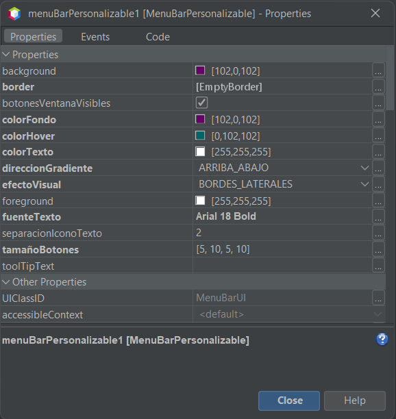
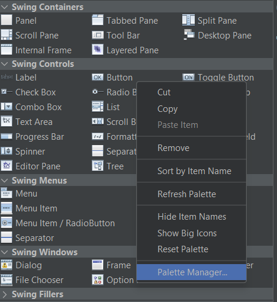
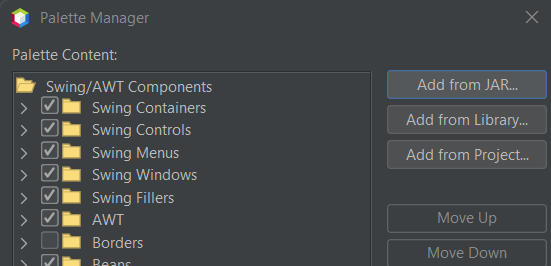
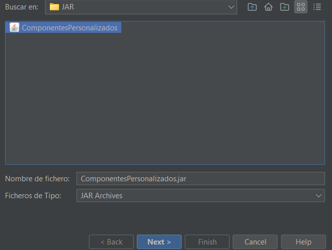
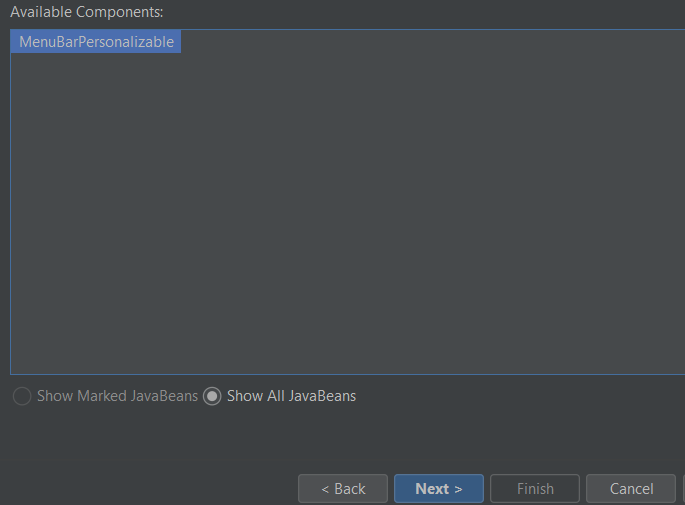
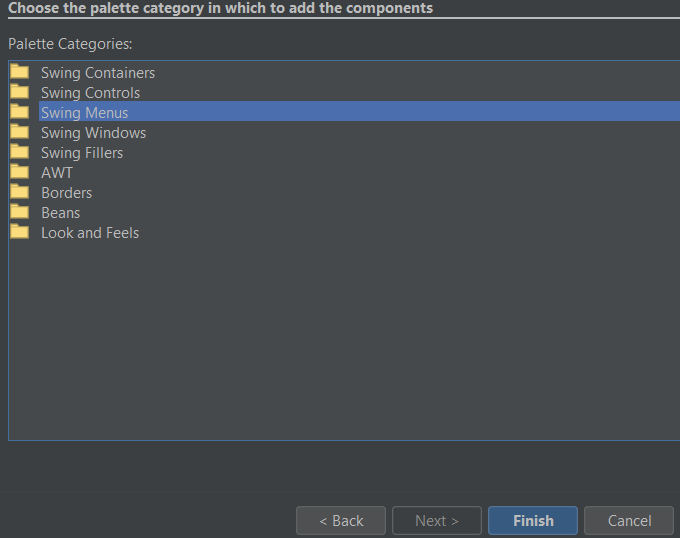
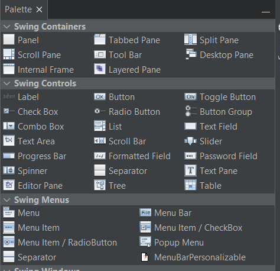
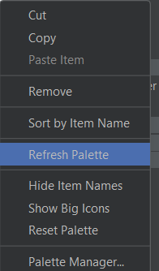

# MenuBarPersonalizable - Componente Visual en Java

## Integrantes del equipo
- Toledo Mariscal Isai Raziel
- Hernández Uvera Azael

## Enlace de YOUTUBE [text](https://youtu.be/8Joq9oHXypw)
---

## Descripción del componente: MenuBarPersonalizable

 Es una barra de menú personalizada para aplicaciones Java Swing, que permite modificar su apariencia visual y comportamiento. Está diseñada para ser reutilizable y fácilmente configurable tanto desde código como desde el editor visual de NetBeans en el apartado de Propiedades de la misma.

El componente incluye botones de control de ventana (minimizar, maximizar/restaurar, cerrar) que pueden habilitarse o no dependiendo la eleccion de quien lo use, efectos visuales como gradientes y bordes, y opciones de estilo como colores, fuentes y espaciados.

---

## Propiedades configurables

Estas propiedades pueden editarse desde el editor visual de NetBeans (Propiedades) o vía código :

- `colorFondo`: Color de fondo de la barra.
- `colorTexto`: Color del texto en los menús y botones.
- `colorHover`: Color al pasar el mouse por los botones.
- `fuenteTexto`: Fuente del texto en los menús.
- `separacionIconoTexto`: Espaciado entre ícono y texto en botones.
- `tamañoBotones`: Tamaño (márgenes) de los botones.
- `botonesVentanaVisibles`: Muestra u oculta los botones de ventana.
- `efectoVisual`: Tipo de efecto aplicado al fondo (`NINGUNO`, `BRIGHTER`, `DARKER`, etc.).
- `direccionGradiente`: Dirección del gradiente aplicado al fondo (`ARRIBA_ABAJO`, `IZQUIERDA_DERECHA`, etc.).

---

## Instrucciones de Instalacion de nuestro Componente:

`Instalacion del Componente`
- Abrir la ventana de palette de neatbeans
- Dentro del palette damos `Click derecho` y seleccionamos la opcion `Palette Manager`
- Seleccionamos la opcion`Add from JAR` 
- Buscamos nuestro archivo jar de nuestro Componente 
- Seleccionamos nuestro Componente y damos en `Next` 
- Asignamos el compartimento en el cual quisieramos agregar nuestro Componente Peronsalibles y damos en `Finish`  
- Cerramos las ventanas emergente y verificamos en nuestro palette en el lugar donde pusimos nuestro `Componente personalizado` 
- En dado caso de que aparezca nuestro componente  no aparezca , daremos nuevamente `CLick derecho` dentro del palette y elegiremos la opcion `Refresh Palette` 

---

## Instrucciones de Uso de nuestro Componente:

-El componente visual se puede agregar directamente desde el palette de neatbeans
-Tiene el mismo comportamiento que un `JMenuBar` en definitivo, asi que se puede invocar desde `Source` o ser agregado visualmente desde `Design` 

---

## Métodos relevantes dentro del codigo de nuestro Componente:
```Java

private void minimizarVentana() -> se encarga de darle funcion al boton Minimizar creado para que se muestren en nuestro menu.
private void maximizarRestaurarVentana() -> se encarga de darle funcion al boton Maximizar creado para que se muestren en nuestro menu.
private void cerrarVentana()-> se encarga de darle funcion al boton Cerrar creado para que se muestren en nuestro menu.
private JButton crearBotonVentana(String texto, ActionListener accion) -> se encarga de darle propiedades a nuestros botones creados de nuestro menu personalizado


